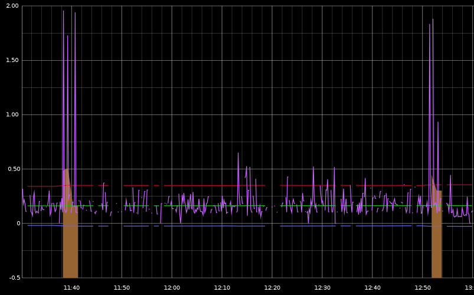

Anode
=====

Anode is a tool for experimenting with different analysis algorithms on metrics and other time series.

Data analysis often starts with getting to know your data. The overarching goal of anode is to advance the open-source offerings for metrics analysis by creating a proving ground for different approaches.

Anode ships with a Graphite input plugin, capable of fetching a named metric from graphite and streaming updates to registered analysis plugins. Each analysis plugin then streams its result to output plugins.

Example
=======

```
./anode.exp -metric=app.latency
```

New metrics will appear in graphite under `anode.threesig` which you can then plot alongside your existing metric. The screenshot below shows the original metric (lilac) with anomalous values highlighted in orange. 



Coming soon
-----------

Write-ups on statistical (and other) approaches to metrics analysis. You can [follow along on twitter](https://twitter.com/mattrco) to stay on top of these, but I'll link to them from this doc too.

Related projects and acknowledgement
------------------------------------

[mozilla-services/heka](https://github.com/mozilla-services/heka)

Heka is a more general data collection and processing system, processing much more than time series. Its data pipeline inspired anode's architecture.

[etsy/skyline](https://github.com/etsy/skyline)

Skyline is an anomaly detection system for time-series data.

Key differences:

* Skyline is production-ready
* It's more work to get set up
* Fairly rigid decision logic for determining whether latest updates to a series are anomalous. Algorithms each return a boolean and majority vote wins. There's no way to apply different analyses to different metrics, which is a key design point of anode.

